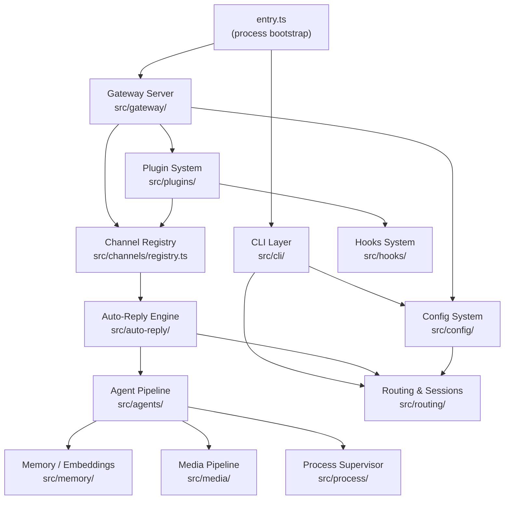

# System Overview

High-level architecture of the OpenClaw gateway — how the entry point, CLI, gateway server, channels, agents, and supporting subsystems connect.

## Key Subsystems

| Subsystem | Path | Role |
|-----------|------|------|
| Entry | `src/entry.ts` | Process bootstrap, respawn logic, env normalization |
| CLI | `src/cli/` | Commander-based command wiring and option parsing |
| Gateway | `src/gateway/` | HTTP/WS server exposing gateway methods |
| Channels | `src/channels/` | Channel registry, session tracking, state machine |
| Agents | `src/agents/` | CLI runner, auth profiles, tool execution |
| Config | `src/config/` | JSON5 config load/parse/validate/write |
| Plugins | `src/plugins/` | Plugin discovery, loading, hook registry |
| Memory | `src/memory/` | Vector/FTS hybrid search and embeddings |
| Media | `src/media/` | Audio/image/PDF processing pipeline |
| Hooks | `src/hooks/` | Fire-and-forget lifecycle hooks, Gmail watcher |
| Process | `src/process/` | Child-process supervisor, lanes, kill-tree |
| Routing | `src/routing/` | Account lookup, session keys, bindings |
| Auto-Reply | `src/auto-reply/` | Reply dispatcher, triggers, heartbeat |
