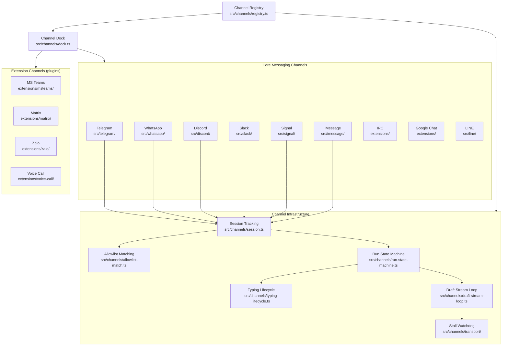
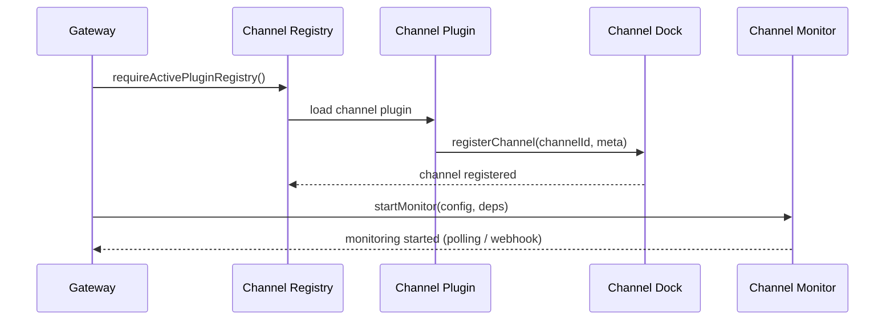

# Channel Architecture

How OpenClaw registers, manages, and dispatches messages across all supported messaging channels.

## Channel Registration Flow

## Supported Channels

| Channel | Type | Path |
|---------|------|------|
| Telegram | Core | `src/telegram/` |
| WhatsApp | Core | `src/whatsapp/` |
| Discord | Core | `src/discord/` |
| Slack | Core | `src/slack/` |
| Signal | Core | `src/signal/` |
| iMessage | Core | `src/imessage/` |
| LINE | Core | `src/line/` |
| IRC | Core/Ext | `extensions/` |
| Google Chat | Ext | `extensions/` |
| MS Teams | Ext | `extensions/msteams/` |
| Matrix | Ext | `extensions/matrix/` |
| Zalo | Ext | `extensions/zalo/` |
| Voice Call | Ext | `extensions/voice-call/` |
