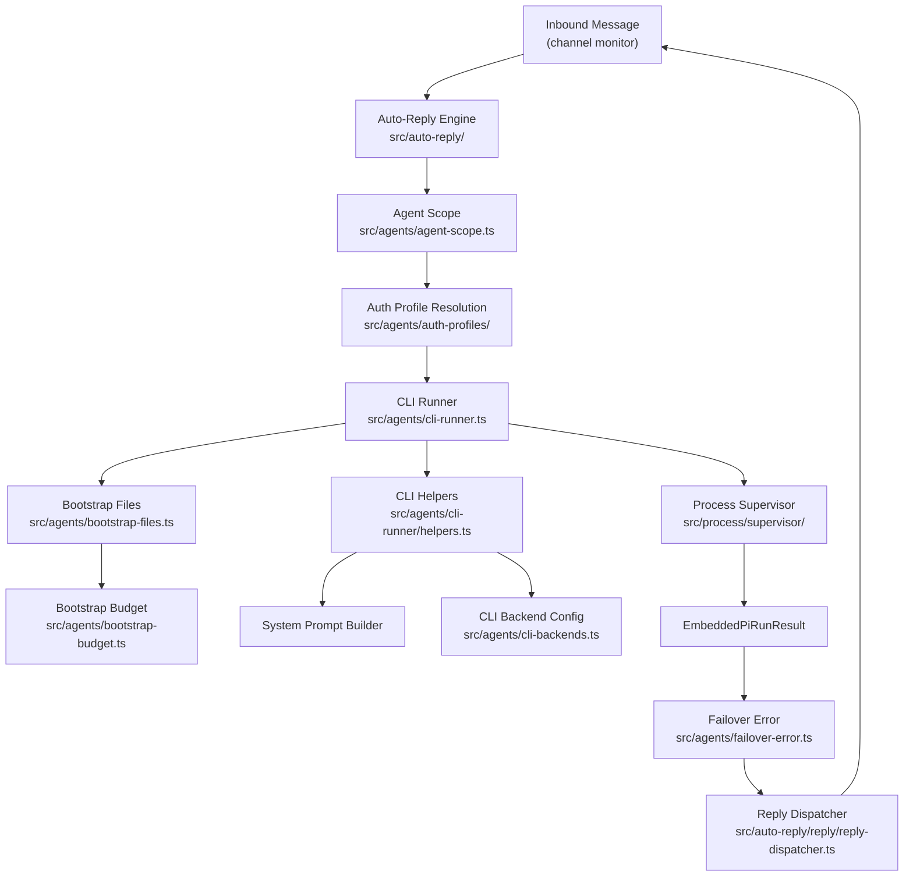
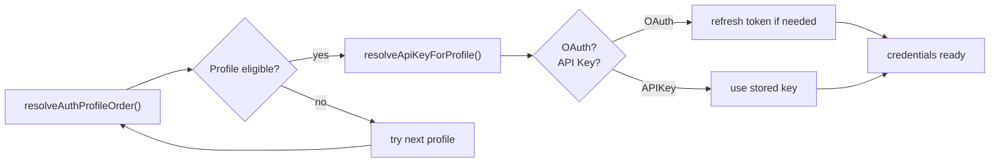
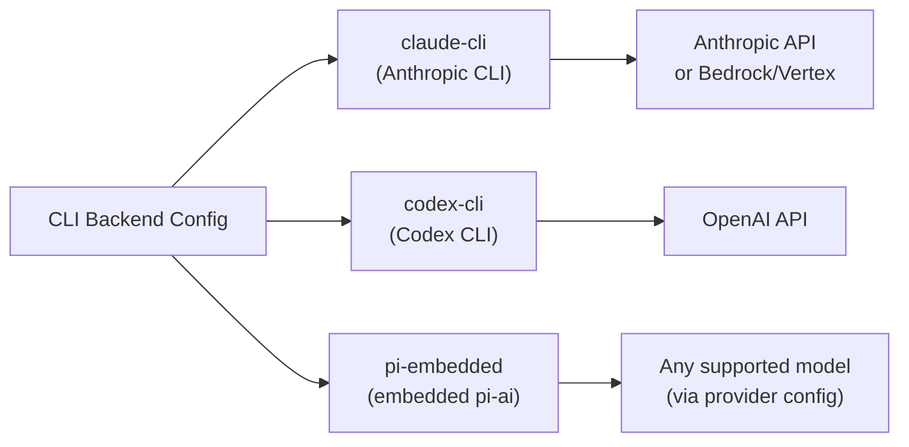
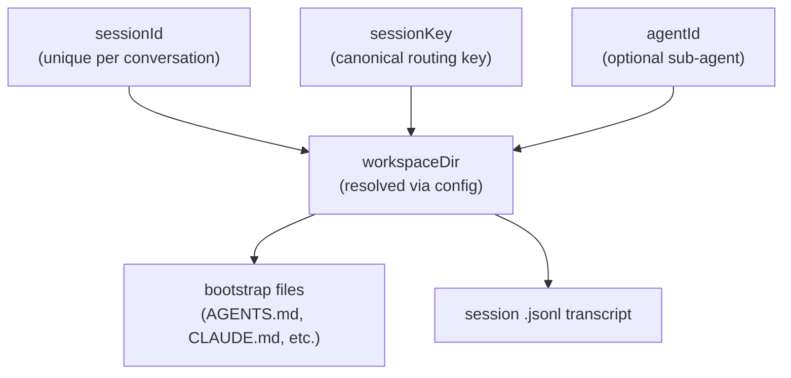

# Agent Pipeline

How OpenClaw spawns, supervises, and manages AI agent runs — from inbound message to final reply.

## Auth Profile Resolution

## CLI Backend Providers

## Session and Workspace Layout

## Key Files

| File | Role |
|------|------|
| `src/agents/cli-runner.ts` | Main agent entry — builds args, runs process |
| `src/agents/cli-runner/helpers.ts` | System prompt, CLI args, image handling |
| `src/agents/auth-profiles/` | Credential store, OAuth, API-key resolution |
| `src/agents/bootstrap-files.ts` | Bootstrap context file resolution |
| `src/agents/bootstrap-budget.ts` | Token budget analysis for bootstrap |
| `src/agents/cli-backends.ts` | Backend config (claude-cli / codex / pi-embedded) |
| `src/agents/failover-error.ts` | Failover detection and retry logic |
| `src/process/supervisor/` | Child-process spawn, track, cancel |
