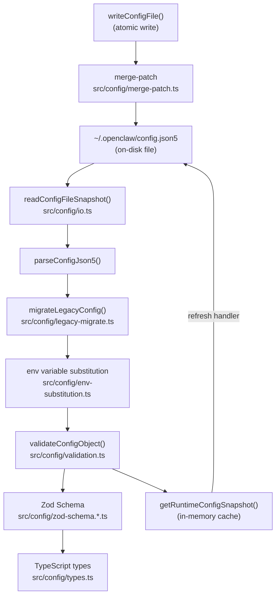
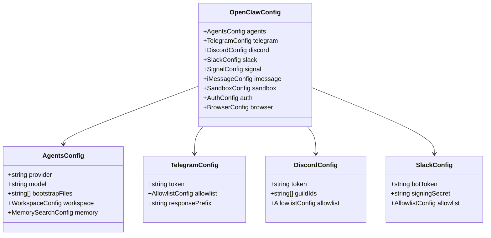
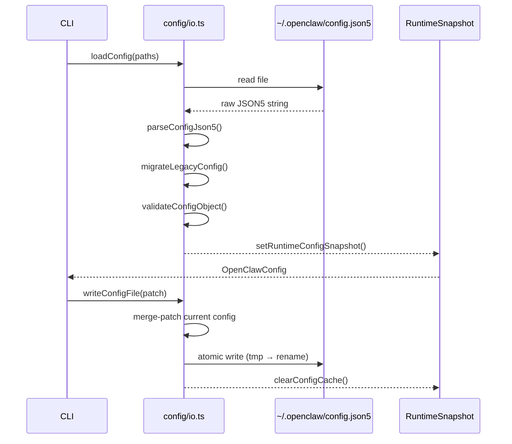

# Configuration System

How OpenClaw loads, validates, merges, and persists its JSON5 configuration.

## Configuration Type Hierarchy

## Config IO Lifecycle

## Key Files

| File | Role |
|------|------|
| `src/config/io.ts` | File read/write, snapshot cache |
| `src/config/types.ts` | Master TypeScript config types |
| `src/config/validation.ts` | Zod-based schema validation |
| `src/config/zod-schema.*.ts` | Sub-schemas (approvals, sandbox, secrets) |
| `src/config/legacy-migrate.ts` | Migrate old config shapes |
| `src/config/env-substitution.ts` | `$ENV_VAR` interpolation in config values |
| `src/config/merge-patch.ts` | JSON Merge Patch (RFC 7396) writer |
| `src/config/defaults.ts` | Default config values |
| `src/config/paths.ts` | Resolve config file paths |
