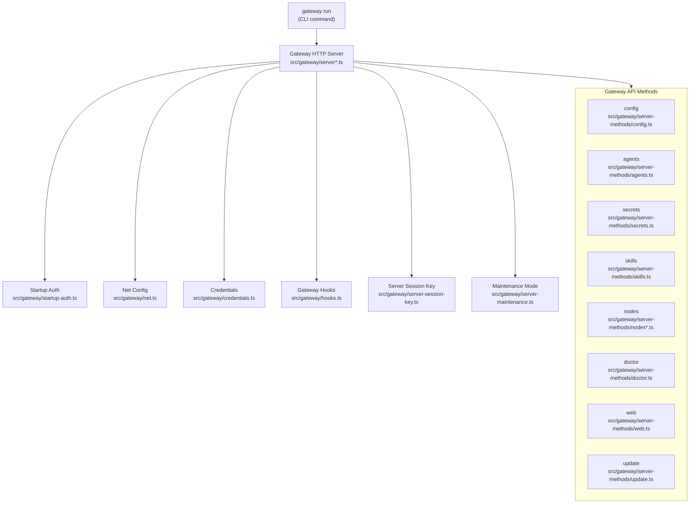
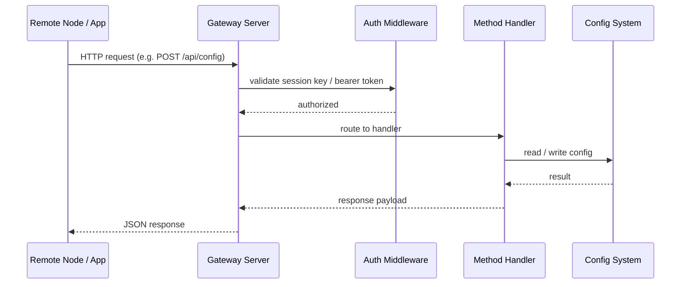
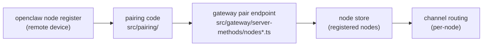
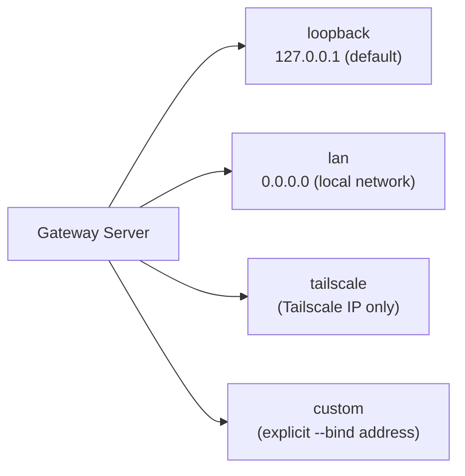

# Gateway Server

The OpenClaw gateway is the central HTTP/WS server that bridges channels, agents, config, and remote nodes.

## Gateway Request Lifecycle

## Node Pairing and Registration

## Gateway Bind Modes

## Key Files

| File | Role |
|------|------|
| `src/gateway/net.ts` | Bind address / port resolution |
| `src/gateway/startup-auth.ts` | Authentication at startup (API key, OAuth) |
| `src/gateway/credentials.ts` | Credential store for gateway |
| `src/gateway/hooks.ts` | Lifecycle hooks fired around gateway events |
| `src/gateway/server-session-key.ts` | Per-session key generation and validation |
| `src/gateway/server-maintenance.ts` | Maintenance mode flag and middleware |
| `src/gateway/server-methods/config.ts` | Read/write gateway config via API |
| `src/gateway/server-methods/agents.ts` | Query/control running agent sessions |
| `src/gateway/server-methods/secrets.ts` | Encrypted secrets management API |
| `src/gateway/server-methods/nodes*.ts` | Node registration, status, pending |
