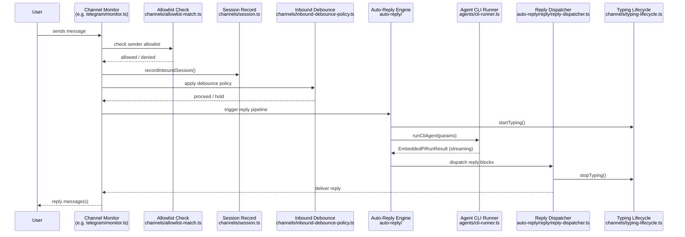
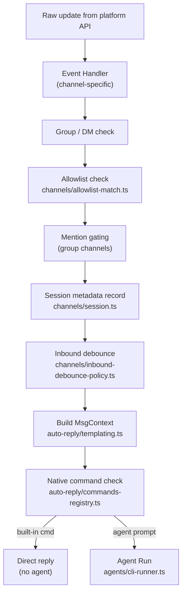
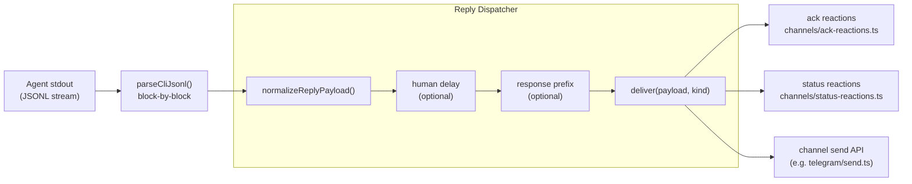

# Message Flow

End-to-end path of a message from arrival on a channel to the final AI reply delivered back to the user.

## Inbound Message Processing

## Reply Dispatch and Streaming

## Key Files

| File | Role |
|------|------|
| `src/channels/allowlist-match.ts` | Evaluate sender against allowlist rules |
| `src/channels/inbound-debounce-policy.ts` | Debounce rapid inbound messages |
| `src/channels/session.ts` | Session metadata recording |
| `src/channels/typing-lifecycle.ts` | Manage typing indicator start/stop |
| `src/auto-reply/` | Trigger evaluation, command dispatch, reply pipeline |
| `src/auto-reply/reply/reply-dispatcher.ts` | Block-by-block delivery with optional delay |
| `src/auto-reply/reply/normalize-reply.ts` | Strip heartbeat, prefix, empty content |
| `src/channels/ack-reactions.ts` | Emoji reactions on message acknowledgement |
| `src/channels/status-reactions.ts` | Status emoji reactions (busy, error, etc.) |
