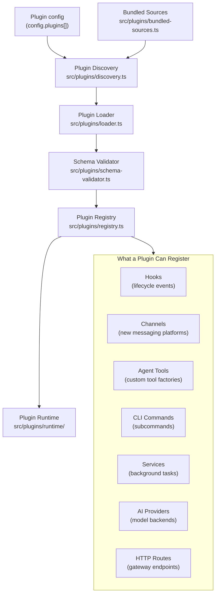
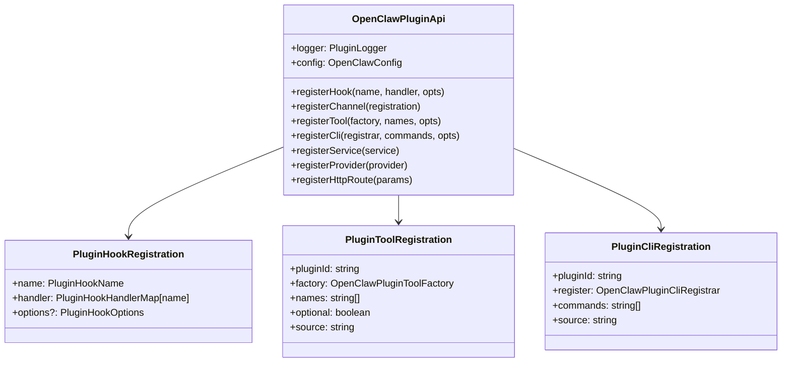
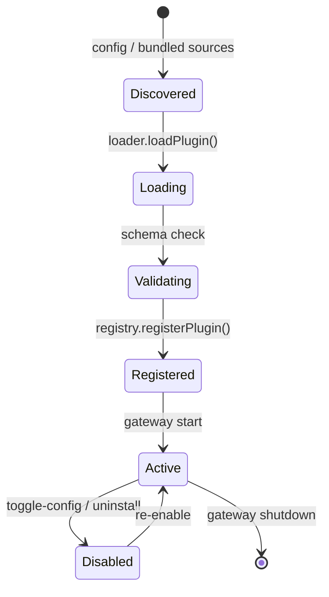
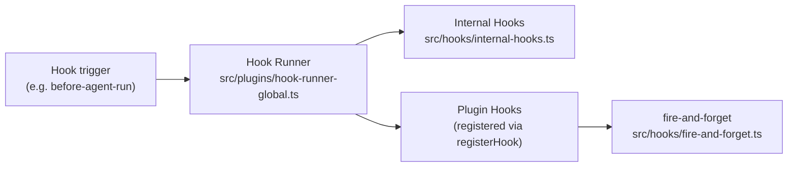

# Plugin System

How OpenClaw discovers, loads, validates, and runs first-party and third-party plugins (extensions).

## Plugin API Surface

## Plugin Lifecycle

## Hook System

## Key Files

| File | Role |
|------|------|
| `src/plugins/discovery.ts` | Find installed plugins on disk |
| `src/plugins/loader.ts` | Dynamic import and initialise plugin module |
| `src/plugins/schema-validator.ts` | Validate plugin manifest schema |
| `src/plugins/registry.ts` | Central registry for all plugin registrations |
| `src/plugins/runtime/` | Runtime state for active plugins |
| `src/plugins/hook-runner-global.ts` | Execute hooks across all plugins |
| `src/plugins/commands.ts` | Register plugin-contributed CLI commands |
| `src/plugins/tools.ts` | Register plugin-contributed agent tools |
| `src/plugins/services.ts` | Manage plugin background services |
| `src/plugins/providers.ts` | Register plugin AI provider backends |
| `src/plugins/update.ts` | Plugin update / install flow |
| `src/plugins/uninstall.ts` | Plugin removal flow |
