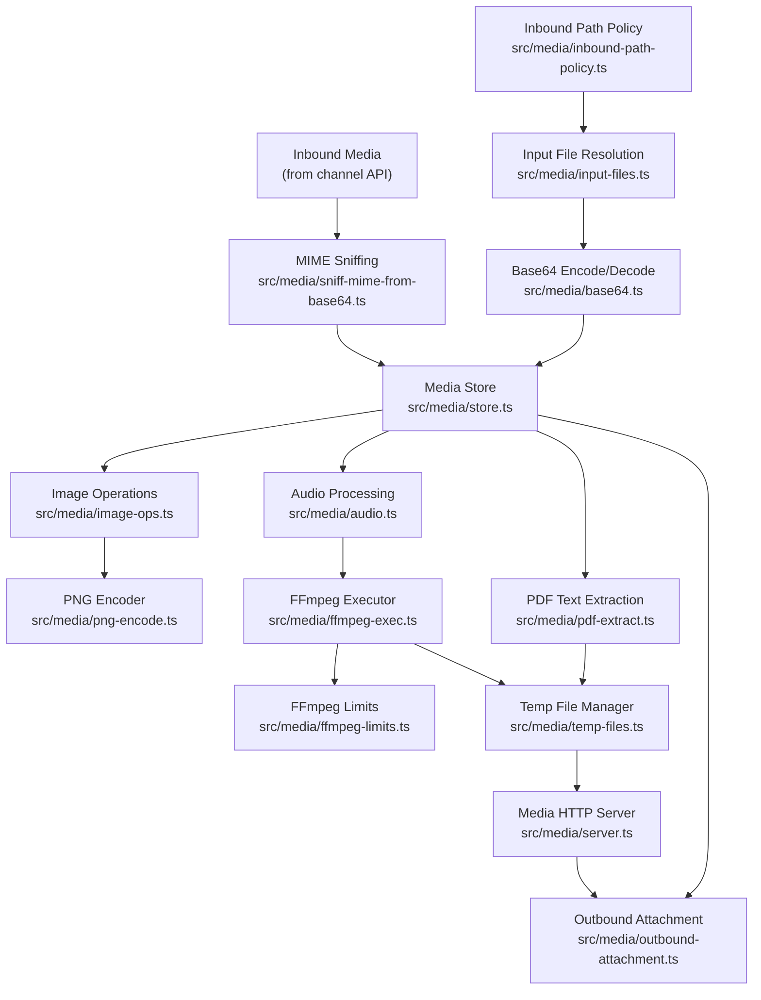
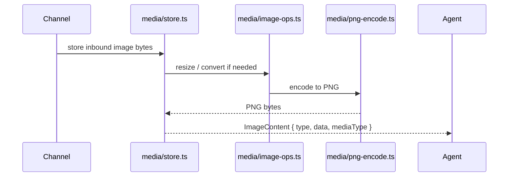
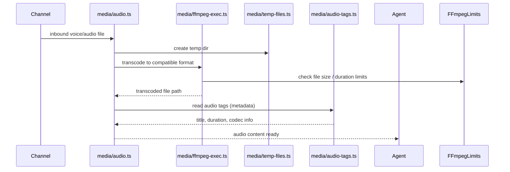
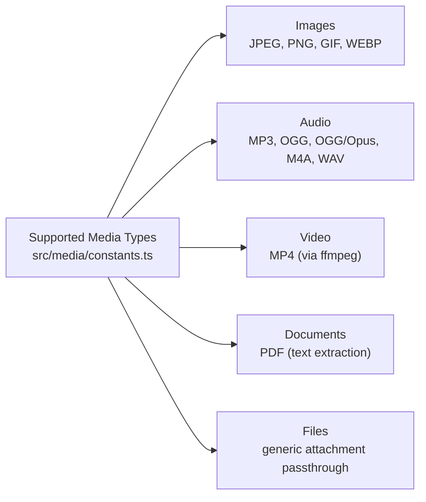

# Media Pipeline

How OpenClaw processes inbound and outbound media: images, audio, video, and documents.

## Image Processing Flow

## Audio Processing Flow

## Media Types and MIME Support

## Key Files

| File | Role |
|------|------|
| `src/media/store.ts` | Central media object store |
| `src/media/audio.ts` | Audio download, transcode, prepare |
| `src/media/ffmpeg-exec.ts` | FFmpeg subprocess wrapper |
| `src/media/ffmpeg-limits.ts` | Size/duration limits enforcement |
| `src/media/audio-tags.ts` | Read ID3/audio metadata tags |
| `src/media/image-ops.ts` | Image resize, crop, convert |
| `src/media/png-encode.ts` | Raw-to-PNG encoding |
| `src/media/pdf-extract.ts` | Extract text content from PDFs |
| `src/media/base64.ts` | Base64 encode/decode helpers |
| `src/media/sniff-mime-from-base64.ts` | Detect MIME type from base64 header |
| `src/media/temp-files.ts` | Temp file lifecycle management |
| `src/media/server.ts` | Serve media files over HTTP (for agent access) |
| `src/media/outbound-attachment.ts` | Prepare attachment for channel send |
| `src/media/input-files.ts` | Resolve file paths from user input |
| `src/media/inbound-path-policy.ts` | Validate allowed inbound media paths |
