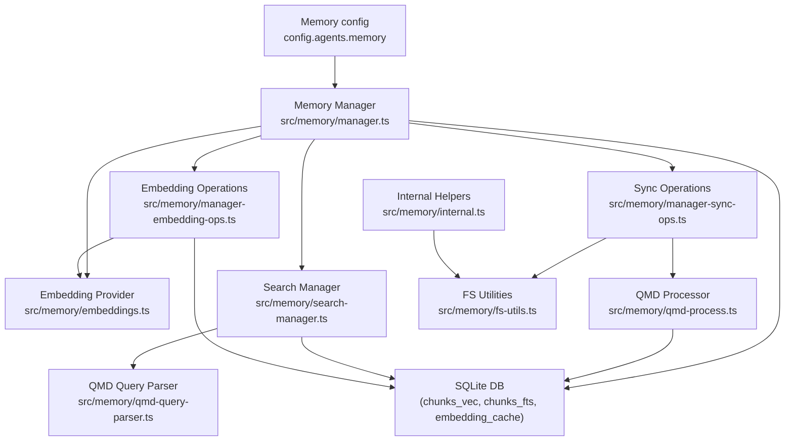
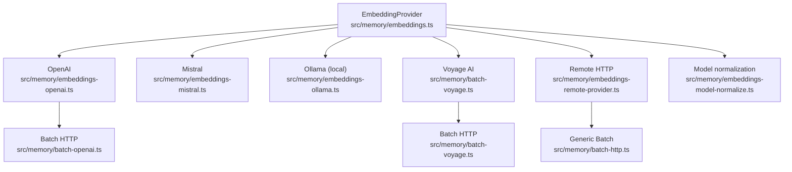
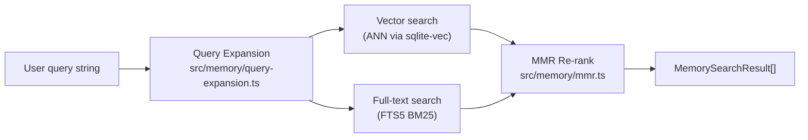
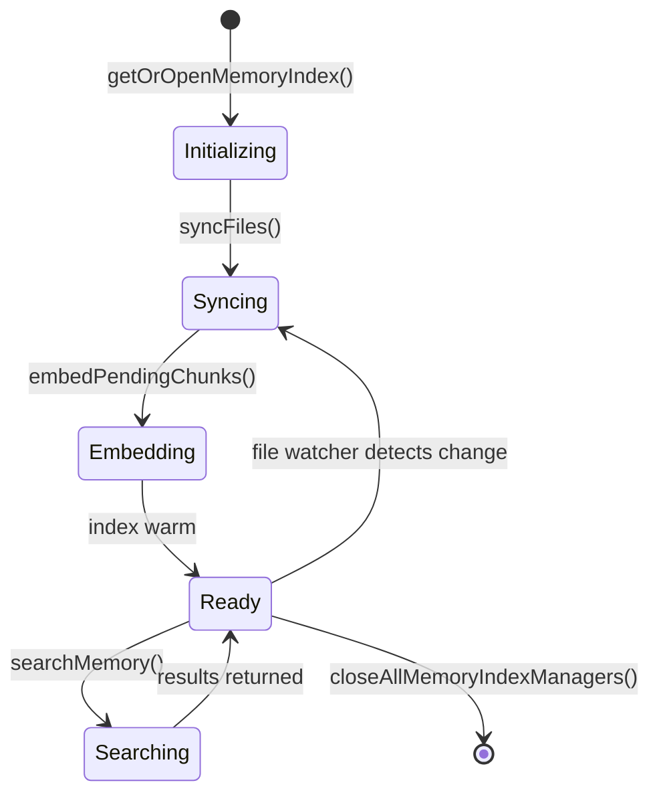
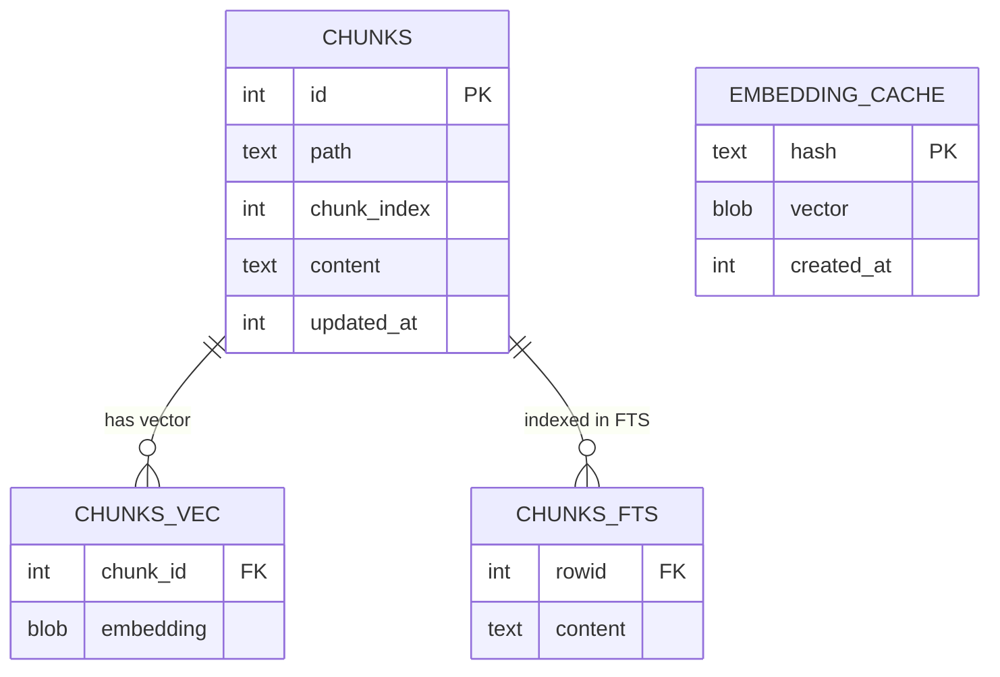

# Memory System

How OpenClaw indexes, embeds, and searches agent memory using a hybrid vector + full-text search engine backed by SQLite.

## Embedding Providers

## Hybrid Search Pipeline

## Memory Index Lifecycle

## SQLite Schema

## Key Files

| File | Role |
|------|------|
| `src/memory/manager.ts` | Top-level memory manager (open/close/search) |
| `src/memory/embeddings.ts` | Abstract embedding provider factory |
| `src/memory/embeddings-openai.ts` | OpenAI text-embedding-3-* |
| `src/memory/embeddings-mistral.ts` | Mistral embed models |
| `src/memory/embeddings-ollama.ts` | Local Ollama embedding models |
| `src/memory/batch-voyage.ts` | Voyage AI batch embedder |
| `src/memory/manager-sync-ops.ts` | Sync markdown files into chunk store |
| `src/memory/manager-embedding-ops.ts` | Compute and cache embeddings |
| `src/memory/search-manager.ts` | Hybrid search (vector + FTS) |
| `src/memory/mmr.ts` | Maximal Marginal Relevance re-ranking |
| `src/memory/qmd-process.ts` | QMD (query memory document) processor |
| `src/memory/qmd-query-parser.ts` | Parse QMD query syntax |
