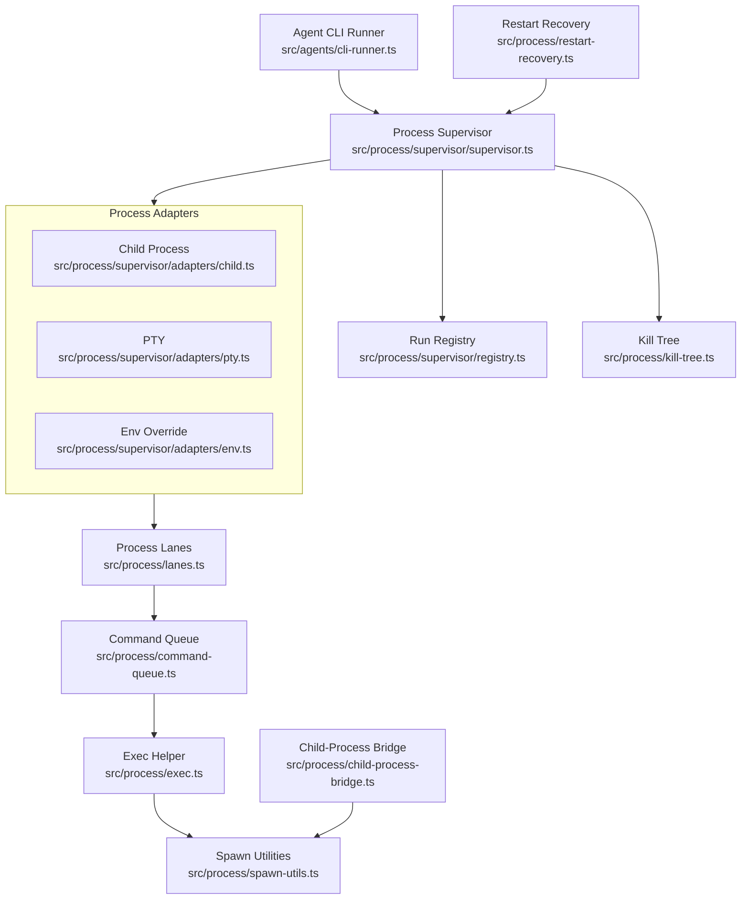
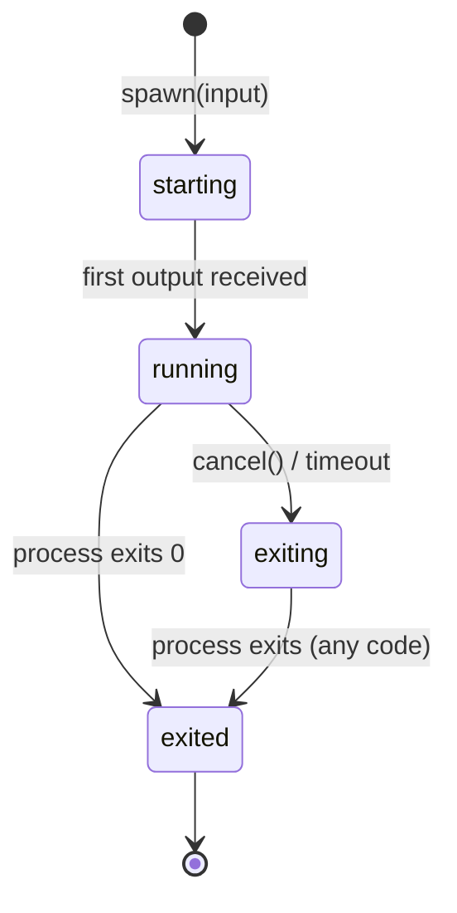
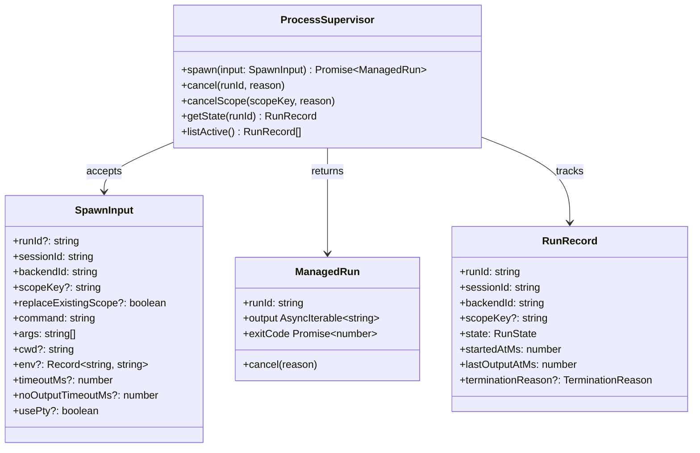
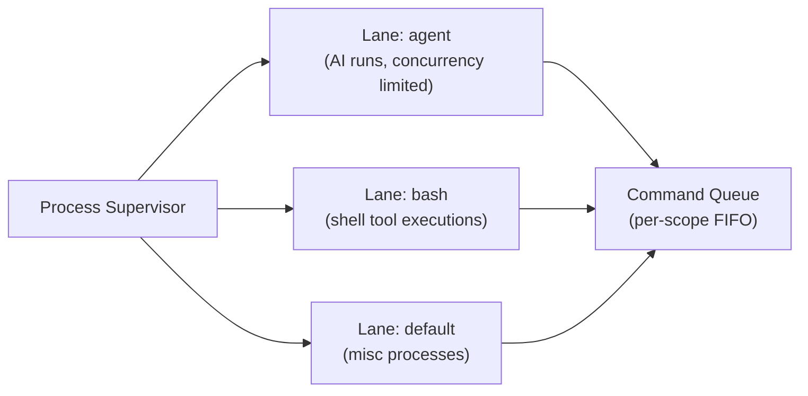
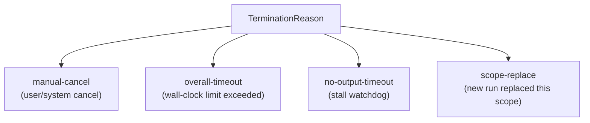

# Process Supervision

How OpenClaw spawns, tracks, and cancels agent child processes through the supervisor layer.

## Process Supervisor State Machine

## Process Supervisor API

## Lanes and Concurrency

## Termination Reasons

## Key Files

| File | Role |
|------|------|
| `src/process/supervisor/supervisor.ts` | Core supervisor: spawn, cancel, track |
| `src/process/supervisor/registry.ts` | In-memory run registry |
| `src/process/supervisor/adapters/child.ts` | Node `child_process.spawn` adapter |
| `src/process/supervisor/adapters/pty.ts` | PTY (pseudo-terminal) adapter |
| `src/process/supervisor/adapters/env.ts` | Environment variable injection |
| `src/process/lanes.ts` | Process lane definitions and concurrency |
| `src/process/command-queue.ts` | Per-scope sequential command queue |
| `src/process/kill-tree.ts` | Recursively kill process tree |
| `src/process/exec.ts` | Low-level exec helper |
| `src/process/spawn-utils.ts` | Cross-platform spawn utilities |
| `src/process/restart-recovery.ts` | Supervisor restart/recovery logic |
| `src/process/child-process-bridge.ts` | IPC bridge for child processes |
