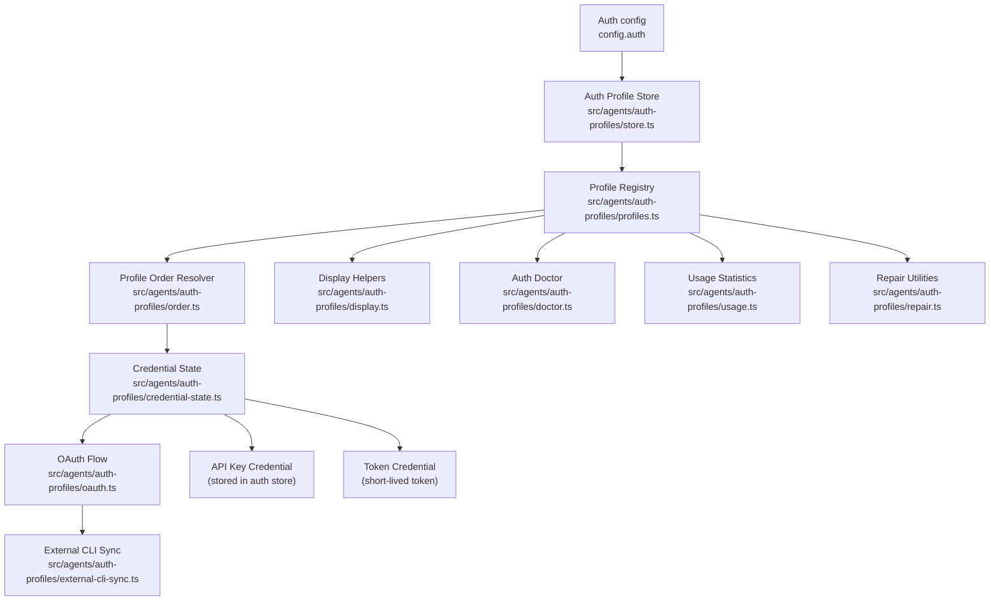
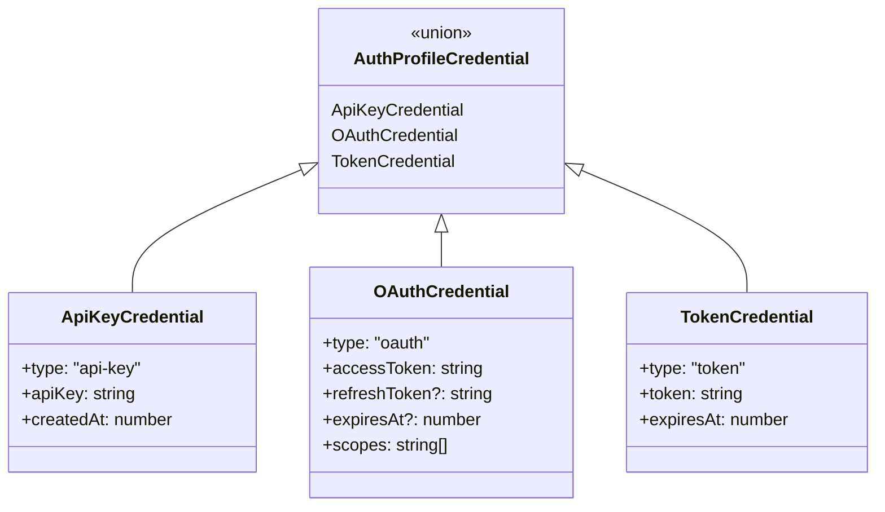
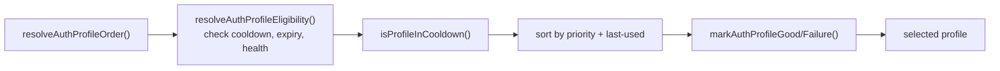
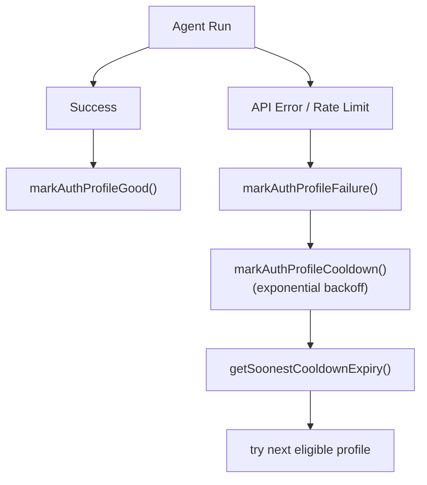
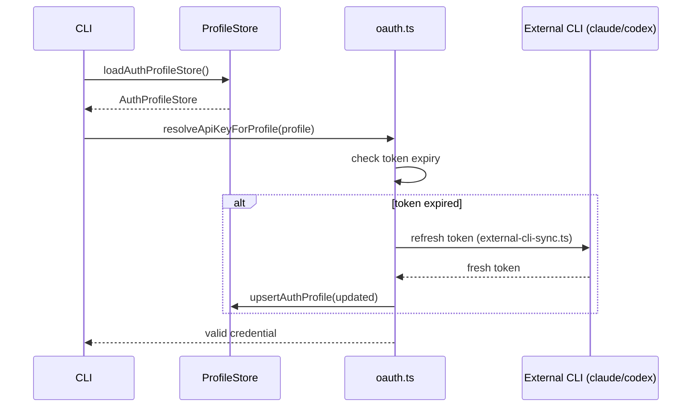

# Authentication Profiles

How OpenClaw manages AI provider credentials — API keys, OAuth tokens, and multi-profile ordering.

## Credential Types

## Profile Resolution Order

## Cooldown and Failure Tracking

## OAuth Profile Session Override

## Key Files

| File | Role |
|------|------|
| `src/agents/auth-profiles/store.ts` | Load/save auth profile store (JSON on disk) |
| `src/agents/auth-profiles/profiles.ts` | Upsert, dedupe, list profiles |
| `src/agents/auth-profiles/order.ts` | Eligibility check and ordering logic |
| `src/agents/auth-profiles/credential-state.ts` | Token expiry, state classification |
| `src/agents/auth-profiles/oauth.ts` | OAuth token resolution and refresh |
| `src/agents/auth-profiles/external-cli-sync.ts` | Sync tokens from external CLI tools |
| `src/agents/auth-profiles/types.ts` | TypeScript credential type definitions |
| `src/agents/auth-profiles/usage.ts` | Track per-profile usage statistics |
| `src/agents/auth-profiles/repair.ts` | Fix mismatched profile IDs |
| `src/agents/auth-profiles/display.ts` | Format profiles for terminal display |
| `src/agents/auth-profiles/doctor.ts` | Diagnose auth configuration issues |
| `src/agents/auth-profiles/paths.ts` | Resolve auth store file paths |
