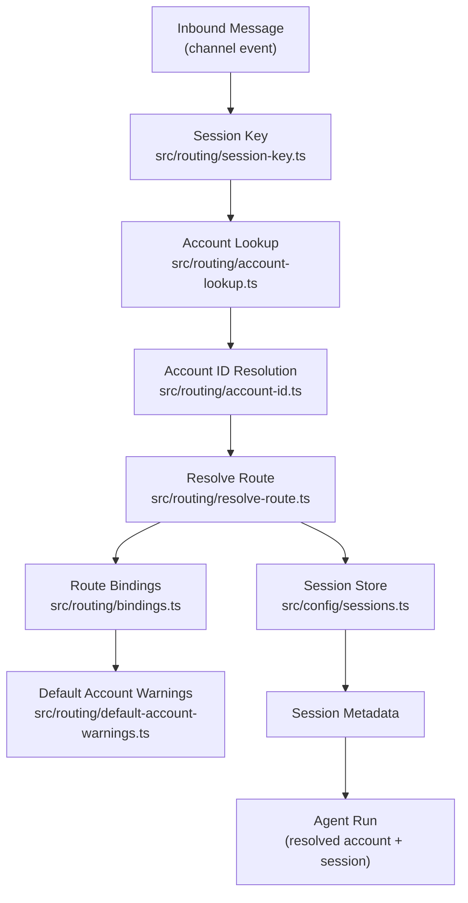
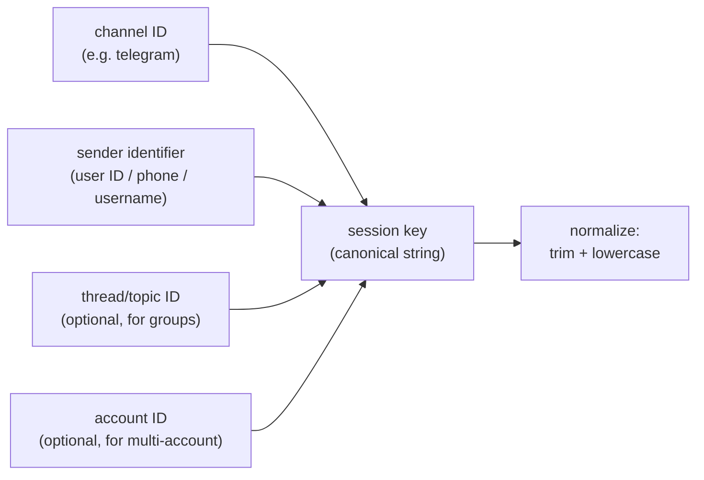
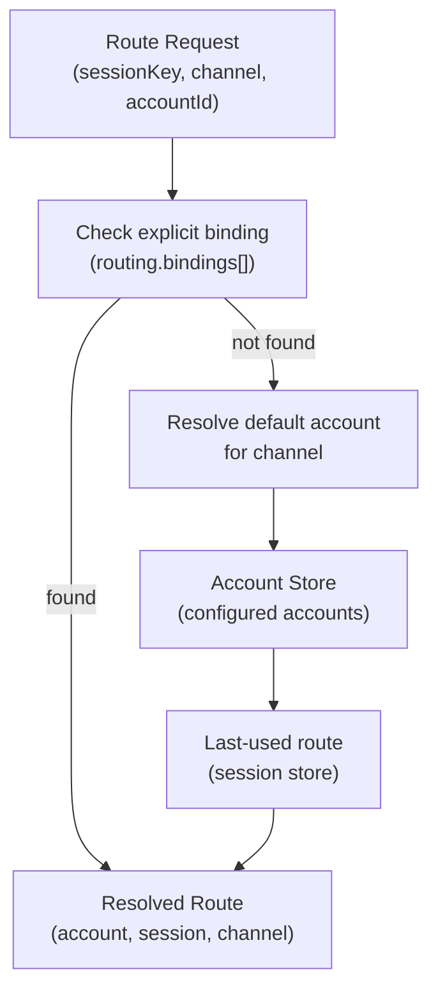
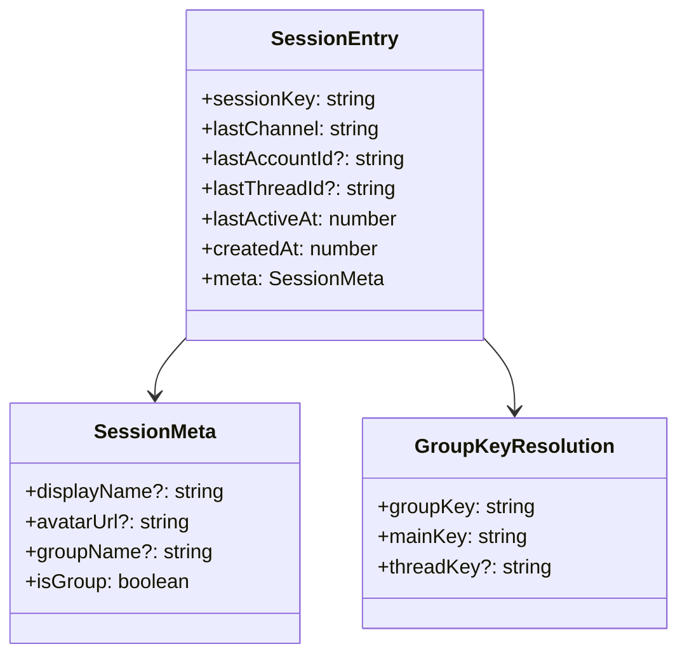
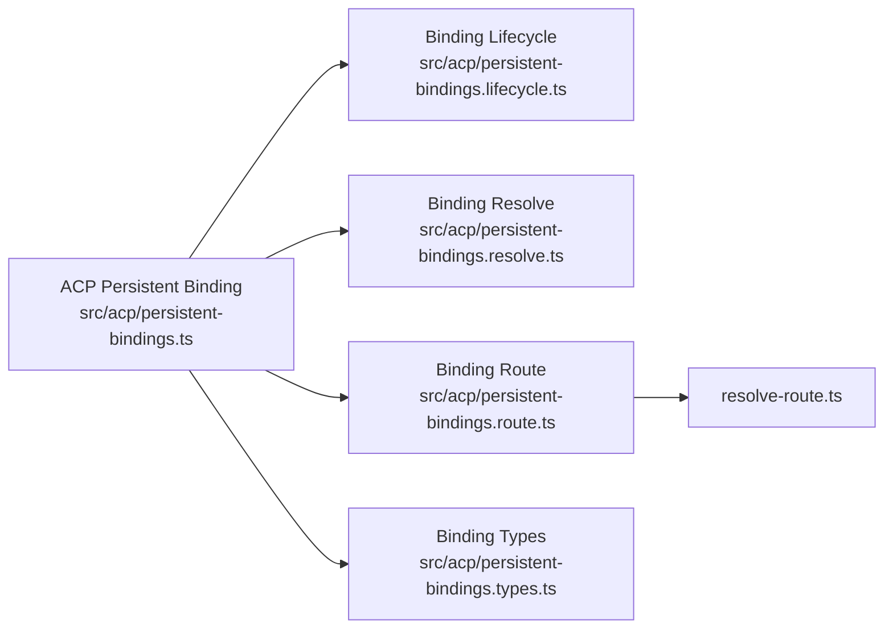
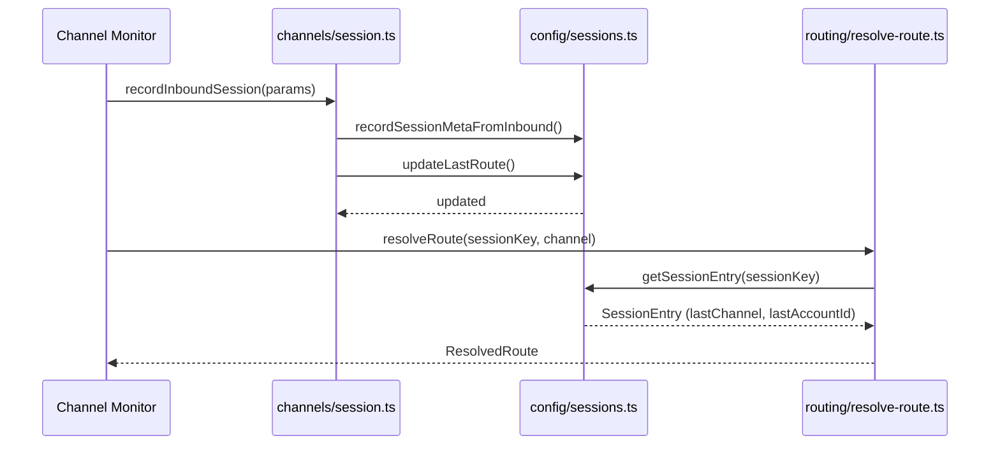

# Routing and Sessions

How OpenClaw determines which account and AI session to route an inbound message to, and how session state is persisted.

## Session Key Derivation

## Route Resolution

## Session Metadata Model

## ACP Persistent Bindings

## Session Continuity

## Key Files

| File | Role |
|------|------|
| `src/routing/session-key.ts` | Derive and normalize session keys |
| `src/routing/account-lookup.ts` | Find account config for a session |
| `src/routing/account-id.ts` | Parse and resolve account identifiers |
| `src/routing/resolve-route.ts` | Main route resolution logic |
| `src/routing/bindings.ts` | Static routing bindings from config |
| `src/routing/default-account-warnings.ts` | Warn when default account is ambiguous |
| `src/channels/session.ts` | Record inbound session and last-route updates |
| `src/config/sessions.ts` | Persistent session metadata store |
| `src/acp/persistent-bindings.ts` | ACP-level persistent session bindings |
